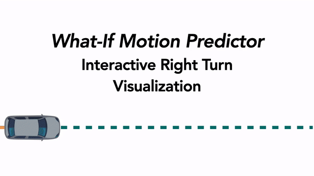

# WIMP - What If Motion Predictor

**Reference PyTorch Implementation for What If Motion Prediction** [[PDF]](https://arxiv.org/abs/2008.10587) [[Dynamic Visualizations]](http://bit.ly/WIMP_viz)

<p align="center">

</p>

## Setup

### Requirements

The WIMP reference implementation and setup procedure has been tested to work with Ubuntu 16.04+ and has the following requirements:

1. python >= 3.7
2. pytorch >= 1.5.0

### Installing Dependencies

1. Install remaining required Python dependencies using pip.

    ``` bash
    pip install -r requirements.txt
    ```

2. Install the [Argoverse API](https://github.com/argoai/argoverse-api) module into the local Python environment by following steps [1](https://github.com/argoai/argoverse-api#1-clone), [2](https://github.com/argoai/argoverse-api#2-download-hd-map-data), and [4](https://github.com/argoai/argoverse-api#4-install-argoverse-module) in the README.

### Argoverse Data

In order to set up the Argoverse dataset for training and evaluation, follow the steps below:

1. Download the the [Argoverse Motion Forecasting v1.1](https://www.argoverse.org/data.html#download-link) dataset and extract the compressed data subsets such that the raw CSV files are stored in the following directory structure:

    ```latex
    ├── WIMP
    │   ├── src
    │   ├── scripts
    │   ├── data
    │   │   ├── argoverse_raw
    │   │   │   ├── train
    │   │   │   │   ├── *.csv
    │   │   │   ├── val
    │   │   │   │   ├── *.csv
    │   │   │   ├── test
    │   │   │   │   ├── *.csv

2. Pre-process the raw Argoverse data into a WIMP-compatible format by running the following script. It should be noted that the Argoverse dataset is quite large and this script may take a few hours to run on a multi-threaded machine.

    ```bash
    python scripts/run_preprocess.py --dataroot ./data/argoverse_raw/ \
    --mode val --save-dir ./data/argoverse_processed --social-features \
    --map-features --xy-features --normalize --extra-map-features \
    --compute-all --generate-candidate-centerlines 6
    ```

## Usage

For a detailed description of all possible configuration arguments, please run scripts with the ```-h``` flag.

### Training

To train WIMP from scratch using a configuration similar to that reported in the paper, run a variant of the following command:

``` bash
python src/main.py --mode train --dataroot ./data/argoverse_processed --IFC \
--lr 0.0001 --weight-decay 0.0 --non-linearity relu  --use-centerline-features \
--segment-CL-Encoder-Prob --num-mixtures 6 --output-conv --output-prediction \
--gradient-clipping --hidden-key-generator --k-value-threshold 10 \
--scheduler-step-size 60 90 120 150 180  --distributed-backend ddp \
--experiment-name example --gpus 4 --batch-size 25
```

## Citing

If you've found this code to be useful, please consider citing our paper!

```
@article{khandelwal2020if,
  title={What-If Motion Prediction for Autonomous Driving},
  author={Khandelwal, Siddhesh and Qi, William and Singh, Jagjeet and Hartnett, Andrew and Ramanan, Deva},
  journal={arXiv preprint arXiv:2008.10587},
  year={2020}
}
```

## Questions

This repo is maintained by [William Qi](mailto:wq@cs.cmu.edu) and [Siddhesh Khandelwal](mailto:skhandel@cs.ubc.ca) - please feel free to reach out or open an issue if you have additional questions/concerns.

We plan to clean up the codebase and add some additional utilities (possibly NuScenes data loaders and inference/visualization tools) in the near future, but don't expect to make significant breaking changes.
